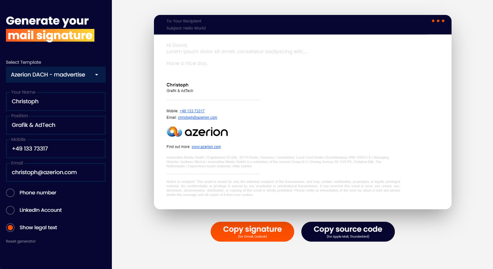

# Email signature generator

Recently the company I work for has joined the [Azerion group](https://www.azerion.com/) (together with some other companies in the DACH region) and we needed new email signatures.

In the past the normal way to "generate" new signatures for everyone, was to create a google doc, building the signature layout and then copy/edit/paste it from there into the different mail clients.

This never worked flawlessly. Problems where either in gmail, which only allows a certain amount of characters (and google docs produce a lot of useless hidden characters!), or Apple mail, which needs the HTML source code, that you can't just copy/paste from a google doc.

At the end many signatures looked different, because there where many workarounds to make it work on every mail client. <b>Let's build a mail signature generator! :-) </b>

 

)

 

The generator is hosted at: [https://we-are-azerion.com/AZtools/mailsig/](https://we-are-azerion.com/AZtools/mailsig/)

It supports different templates, which are seperate html files (with "nice" oldschool table layouts).
